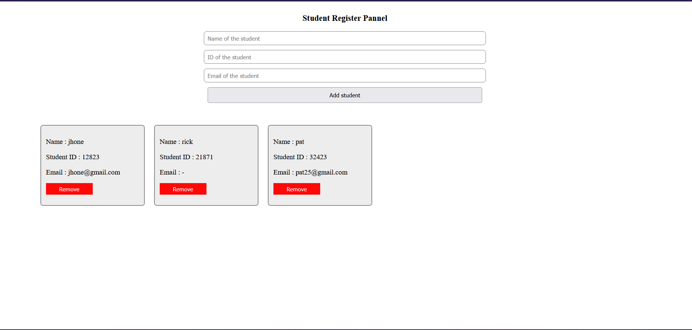

# 📋 Register Panel

A simple and interactive student registration panel built with **HTML**, **CSS**, and **JavaScript**.

🚀 [Live Demo](https://thnav.github.io/Register-Pannel/)

---

## ✨ Features

- Register student name and ID
- Auto-display new entries in real-time
- Delete button to remove any entry
- Input validation to prevent empty submissions

---

## 💡 How It Works

1. User enters a student name and ID
2. On clicking **Register**, a new student box appears
3. Each student box includes:
   - ✅ Name & ID
   - ❌ Delete button to remove the student

---

## 🛠️ Technologies Used

- HTML5
- CSS3
- Vanilla JavaScript (ES6)

---

## 📌 Note

This is a beginner-friendly project focused on DOM manipulation and interactive elements. Data is **not saved** after refreshing the page — future versions may include `localStorage` or backend support.

---

## 📷 Preview

---

## 🙌 Author

Made with ❤️ by **thnav**  

